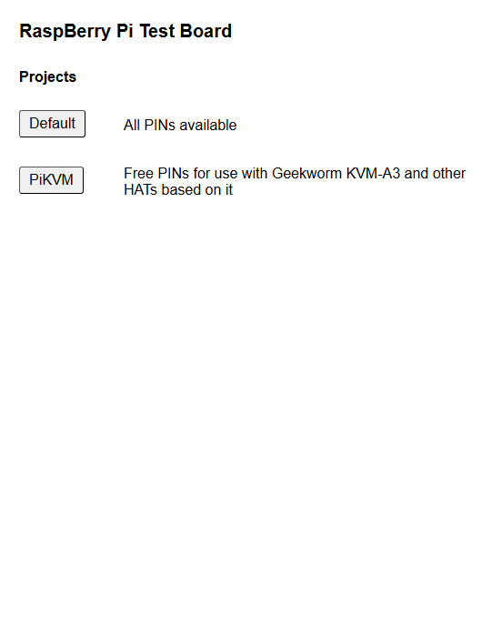
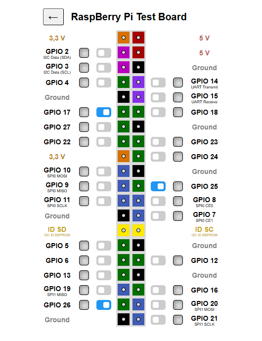
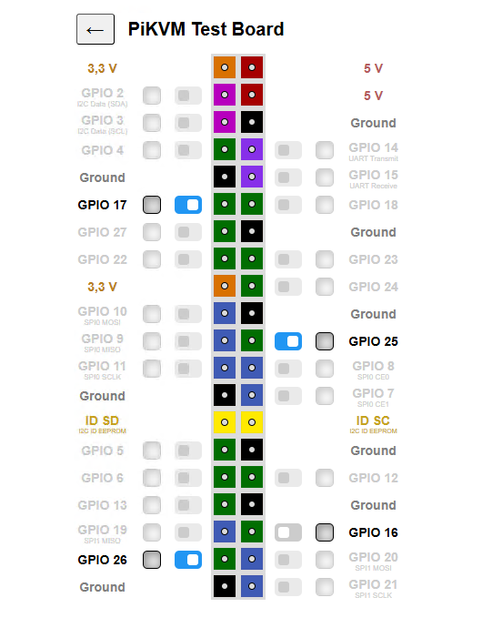

# GPIOWebInterface
Raspberry Pi webserver to control GPIO using Node.JS

## Description
WebApp, Browserbased, customizable, multiple projects

## Requierements
Tested with the following Components:
- Raspberry Pi 3 (should also work with RPi 4)
- Raspberry Pi OS Lite 64bit (Bookworm)
- Node JS 24.0.7

## Screenshots
Homepage

Project "Default"

Project "PiKVM"

## Installation and Configuration
The Installation and Configuration is quite easy. All you need is Raspberry Pi and a SD-Card with Pi OS Lite 64bit (Bookworm).
- <a href="DOCS/install.md">Installation</a>
- <a href="DOCS/config.md">Configuration</a>

## Credits
Thanks to StevesRandomProjects. This Project was inspired by <a href="https://github.com/StevesRandomProjects/PiGpioWebServer" target="_blank">StevesRandomProjects - PiGpioWebServer</a>.

