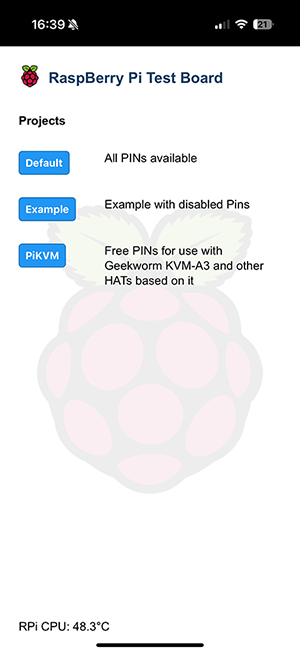

# GPIOWebInterface
Raspberry Pi webserver to control GPIO using Node.JS

## Description
This is a Hobby-Project to easy switch the GPIOs on a Raspberry Pi by browser, without knowing of scripting like python or similar. It is customizable and you can use it as WebApp (tested with iOS) or in traditional Browser. You can simple add Projects with different settings, styles and Background-images. It supports Dark and Light mode.

## Requierements
Tested with the following Components:
- Raspberry Pi 3 (should also work with RPi 4)
- Raspberry Pi OS Lite 64bit (Bookworm)
- Node JS 24.0.7

## Installation and Configuration
The Installation and Configuration is quite easy. All you need is a Raspberry Pi and a SD-Card with Pi OS Lite 64bit (Bookworm).
- <a href="DOCS/install.md">Installation</a>
- <a href="DOCS/config.md">Configuration</a>

After you have successfully installed and configured the server, the webinterface should be reachable under: 
http://[IP or FQDN of your pi]

## Screenshots
Homepage

Project "Default"

Project "PiKVM"

## Credits
Thanks to StevesRandomProjects. This Project was inspired by <a href="https://github.com/StevesRandomProjects/PiGpioWebServer" target="_blank">StevesRandomProjects - PiGpioWebServer</a>.

